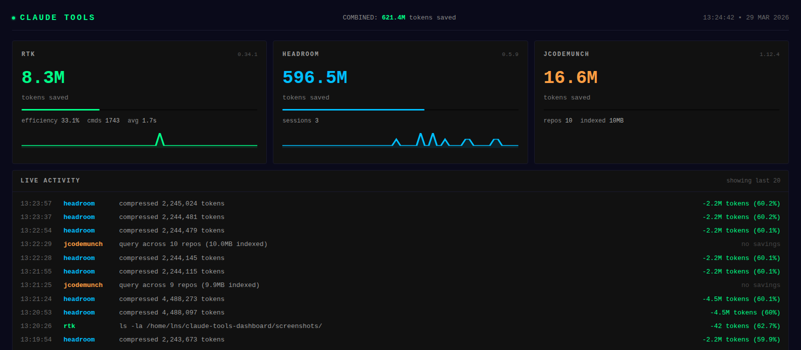

# Claude Room

[](https://www.python.org/)
[](LICENSE)

Live wallboard for Claude Code token savings and subscription usage. Aggregates [RTK](https://github.com/Will-Luck/rtk) (CLI proxy) and [Headroom](https://github.com/chopratejas/headroom) (compression proxy) into a single-screen view with sparklines, weekly burn rate, and your Anthropic 5-hour / weekly / Sonnet usage percentages.



## What it shows

- **RTK** — command-level token savings from the CLI proxy (SQLite)
- **Headroom** — context compression stats from the MCP server (`/stats` HTTP API)
- **Combined** — combined savings with sparkline, this-week delta, and daily burn rate
- **Usage** — Claude 5-hour / weekly / Sonnet utilization + next reset, sourced from Headroom's `subscription_window.latest` (no Anthropic credentials required)
- **Activity feed** — live stream of compression events and RTK commands

## Quick start

### Local

```bash
git clone https://github.com/beatwiz/claude-room.git
cd claude-room
pip install -r requirements.txt
python app.py
# http://localhost:8095
```

### Docker (build from source)

```bash
./build.sh
# http://localhost:8095
```

`build.sh` rebuilds the image, replaces the container, mounts your RTK SQLite DB, and pipes your host `rtk --version` into the container so the card displays the right version. Override via env: `PORT`, `IMAGE`, `CONTAINER`, `DOCKER_NETWORK`, `HEADROOM_URL`, `TZ`.

Headroom must be reachable from the container — the default `HEADROOM_URL=http://host.docker.internal:8787` works on Docker Desktop. On Linux, either use `--network host` or point `HEADROOM_URL` at your host IP.

## Requirements

- **[Headroom](https://github.com/chopratejas/headroom) >= 0.5.25** — the subscription window poller (5-hour / weekly / Sonnet utilization) was added in this version. Earlier versions do not include it and the Usage card will show as inactive.
- **[RTK](https://github.com/Will-Luck/rtk)** — CLI proxy for command-level token savings.

```bash
pip install --upgrade headroom-ai
pip install headroom-ai[code]  # optional: adds tree-sitter grammars (~50MB) for AST-based code compression
```

### Starting Headroom

The dashboard reads all data from Headroom's `/stats` endpoint. Start the proxy before launching the dashboard:

```bash
headroom proxy --memory --memory-db-path ~/.headroom/memory.db --no-telemetry --learn --code-aware
```

| Flag | Purpose |
|------|---------|
| `--memory` | Enable persistent user memory |
| `--memory-db-path` | Memory database location |
| `--no-telemetry` | Disable anonymous usage telemetry |
| `--learn` | Extract error/recovery patterns from proxy traffic (implies `--memory`) |
| `--code-aware` | AST-based code compression via tree-sitter (requires `headroom-ai[code]`) |

The proxy listens on `http://127.0.0.1:8787` by default. Point Claude Code at it:

```bash
ANTHROPIC_BASE_URL=http://localhost:8787 claude
```

**Optional:** Set `ANTHROPIC_API_KEY` to enable exact token counting via the Anthropic API (free, no credits consumed). Without it, Headroom falls back to tiktoken approximation and logs a warning.

## Configuration

All settings via environment variables. See `.env.example` for the full list.

| Variable | Default | Description |
|----------|---------|-------------|
| `PORT` | `8095` | Dashboard listen port |
| `HEADROOM_URL` | `http://127.0.0.1:8787` | Headroom proxy base URL (`/stats`, `/health`) |
| `RTK_DB_PATH` | `~/.local/share/rtk/history.db` | RTK SQLite database |
| `RTK_BIN` | `rtk` | RTK binary name or path |
| `RTK_VERSION` | _(auto)_ | Override RTK version string (used in containers) |
| `COLLECTOR_INTERVAL` | `0.25` | Seconds between background collector ticks |
| `SSE_INTERVAL` | `2` | Seconds between SSE pushes to connected clients |
| `WEEKLY_CACHE_DIR` | `~/.cache/claude-tools-dashboard` | Weekly savings snapshot directory |
| `TZ` | _(system)_ | Timezone for reset-countdown rendering |

## API

| Endpoint | Description |
|----------|-------------|
| `GET /` | Dashboard HTML (self-contained SPA, no build step) |
| `GET /health` | JSON liveness check |
| `GET /api/status` | One-shot snapshot of the current aggregated state |
| `GET /events` | SSE stream, pushed every `SSE_INTERVAL` seconds |

## Architecture

Single-file Flask app (`app.py`) with no frontend build step:

1. A background collector ticks every `COLLECTOR_INTERVAL` seconds, hitting RTK's SQLite DB and Headroom's `/stats` endpoint. Both calls share one `/stats` fetch per tick.
2. Per-tick snapshots update sparkline buffers and a weekly baseline stored in `WEEKLY_CACHE_DIR/weekly.json`. The cache is fingerprinted with the current `combined_saved` formula and auto-invalidates when the formula changes.
3. Claude subscription usage is parsed from `subscription_window.latest` in the same `/stats` payload — no Anthropic OAuth handling, no credential mount.
4. The latest snapshot is pushed to connected browsers over SSE; the frontend is vanilla JS + inline SVG sparklines.

## Tests

```bash
pip install -r requirements-dev.txt
python -m pytest tests/ -v
```

The suite covers the collector fallback paths, weekly-cache schema migrations, the `_flatten_snapshot` helper, and the `/api/status` route contract. Background collector and SSE streaming are not covered.

## License

MIT
